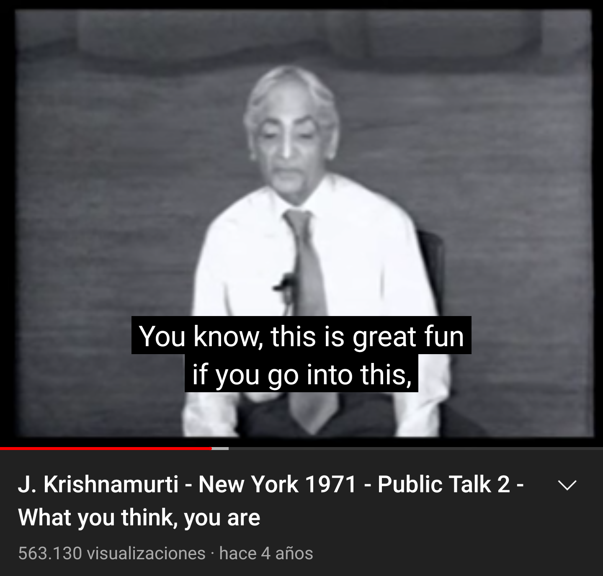
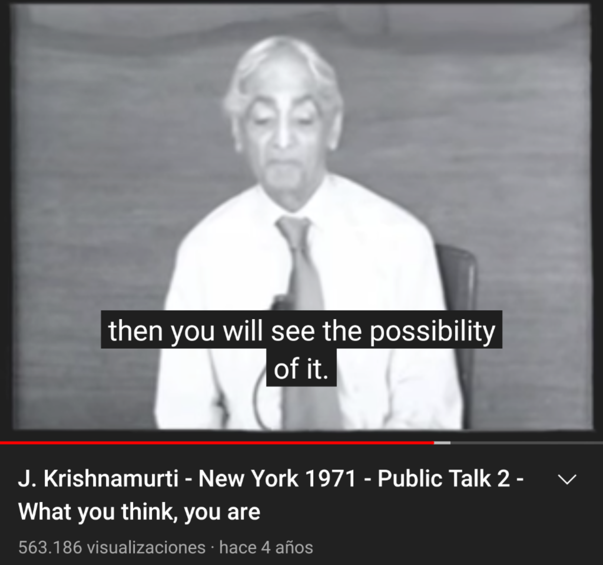
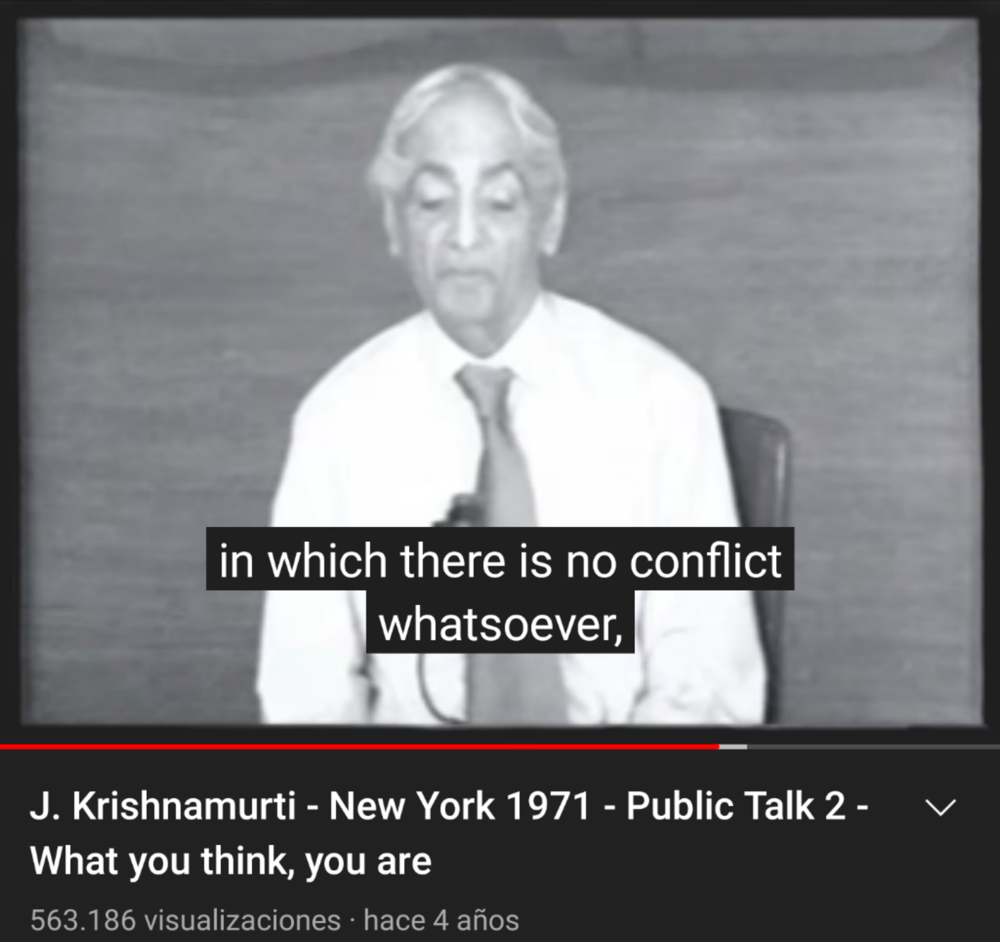
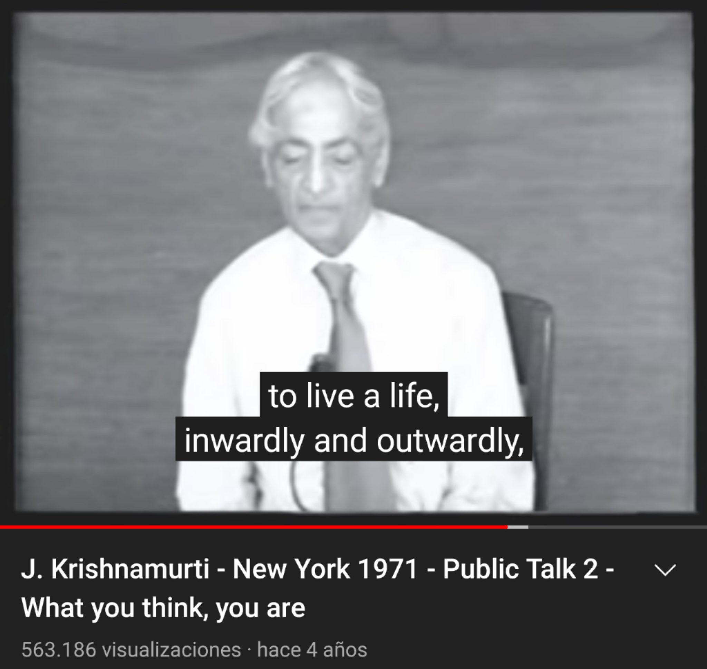
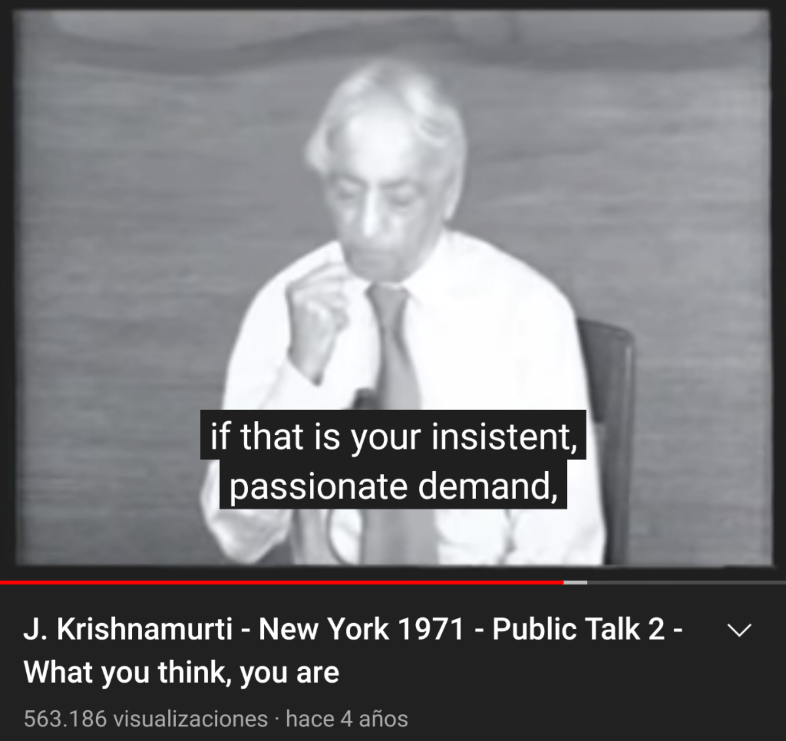
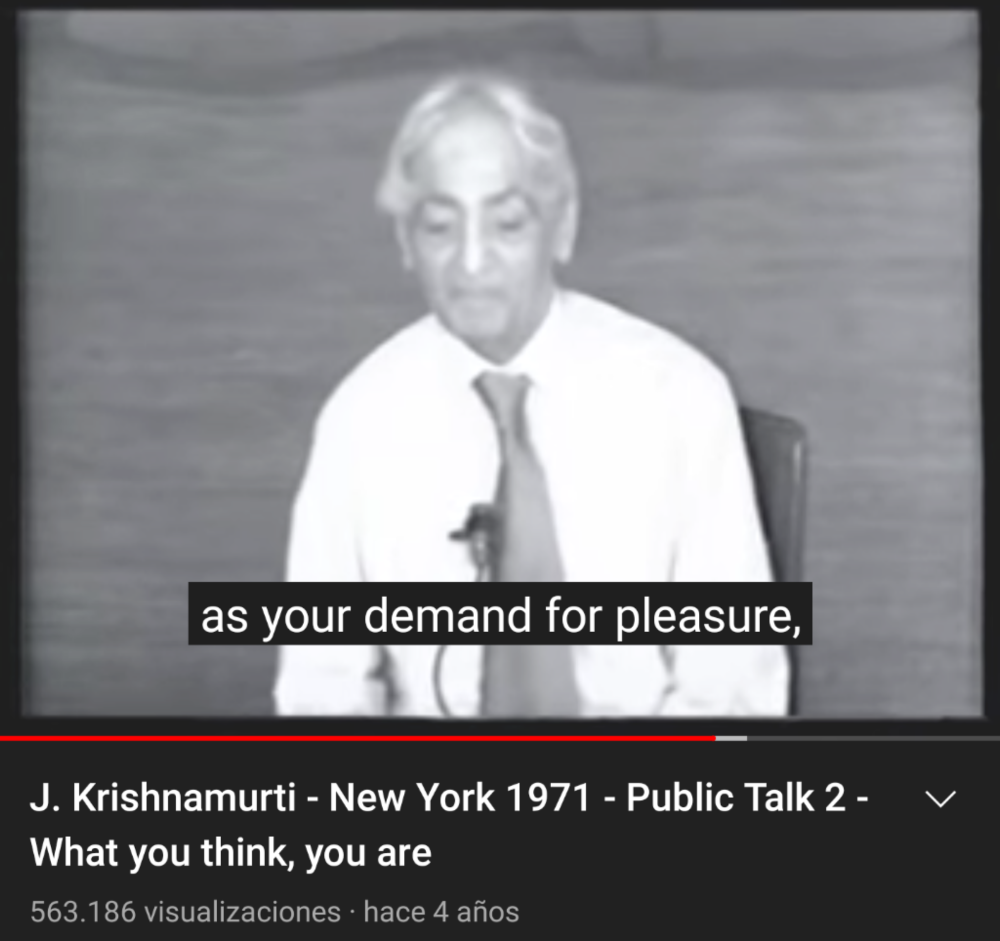
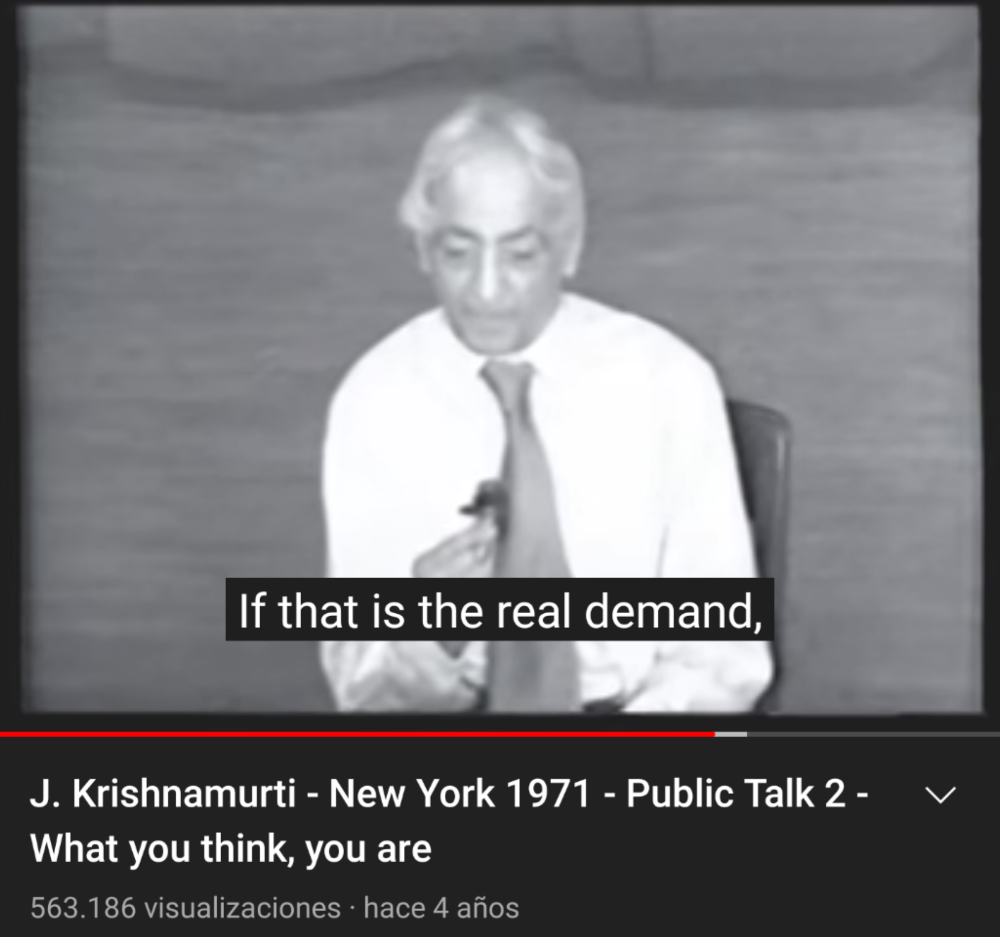
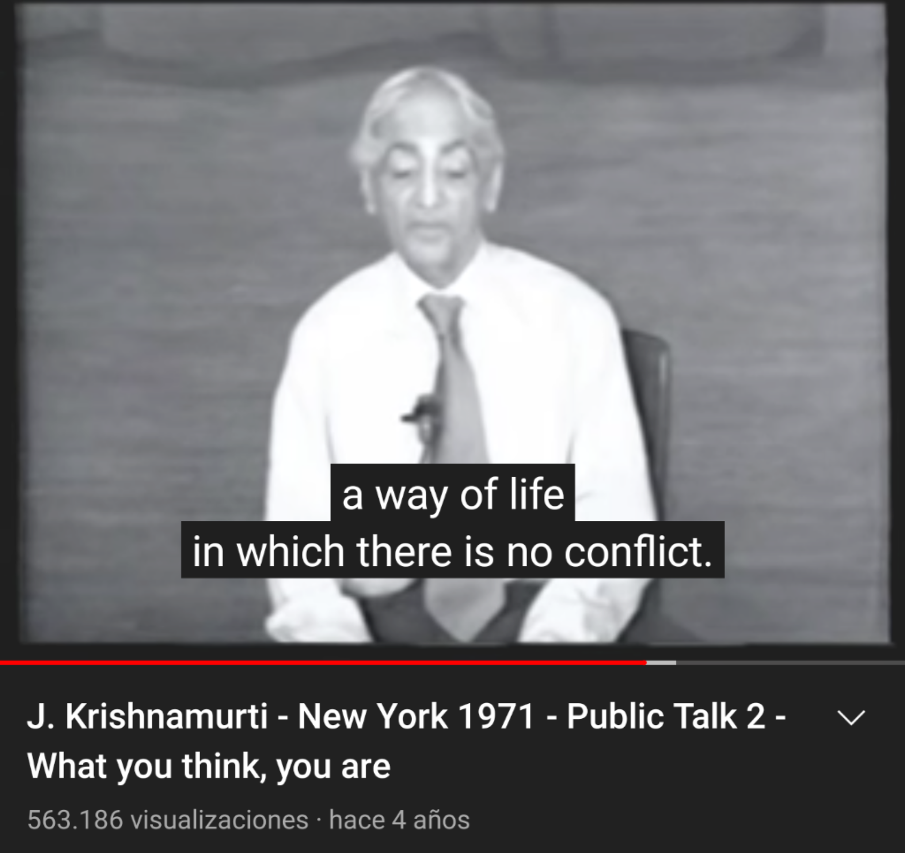
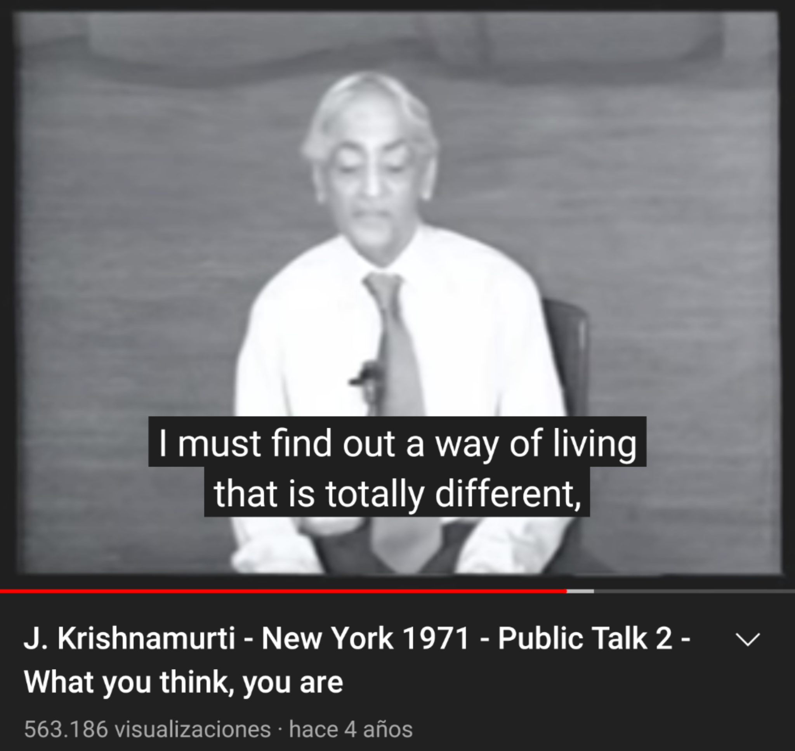

Beyond the [perpetual onion-peeling](https://youtu.be/cl93xw5F3cI?t=10m35s) of analysis and meta-analysis, there is a a non-dogmatic, non-symbolic field. I'll meet you there.

"The entirety of consciousness. Great fun." https://youtu.be/cl93xw5F3cI?t=33m55s

"Not the speaker analyzing you (like) second hand and third hand human beings..."
https://youtu.be/cl93xw5F3cI?t=35m38s

As long as there is division there is conflict. "Tolerance, which is *an intellectual covering for intolerance*." https://youtu.be/cl93xw5F3cI?t=52m42s

"Thought is worshiped throughout the world as the most extraordinarily important thing; and thought has separated itself as The Thinker."
https://youtu.be/cl93xw5F3cI?t=55m26s

"To be aware of all the machinery of thought ..."
https://youtu.be/cl93xw5F3cI?t=1h09m32s

