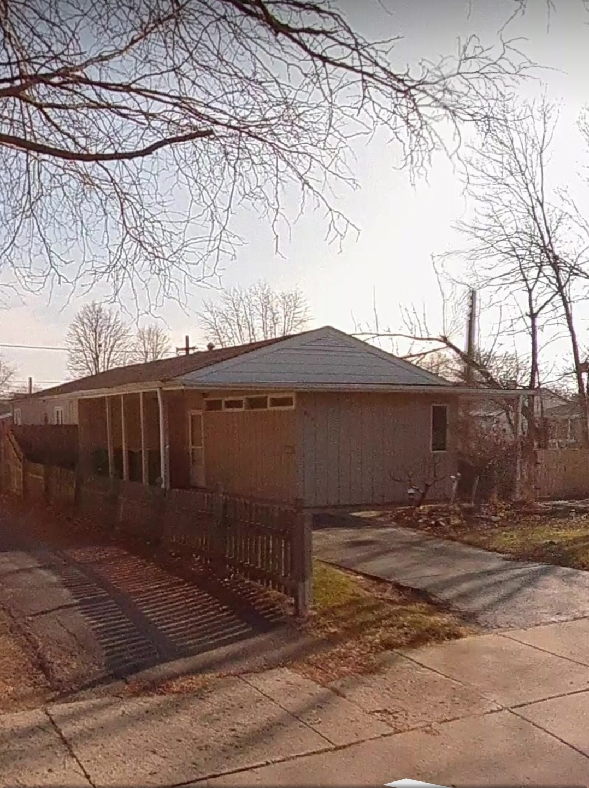

### A thought experiment.

Another lifelong friend and encourager is in hospice. Such a persistent role model of faith and determination for her family, community, the world.

With the most profound respect and wonder, sans sadness or remorse, how would my (our) lived experiences be different if we centered the conscious awareness that we too are actively dying, daily?

I'm suggesting that it is not contradictory to be happy, healthy, grateful, light, and love; to be diligent in extending healthy longevity, while simultaneously and soberly contemplating and observing our experience from this frame of reference.

I'm suggesting that it need not be a buzzkill. In fact, always chasing a better buzz seems to be a primary practice of those anxious or avoidant of this most fundamental of all realities of embodied biological existence. We want to live. We don't want to think of the end of our lives. 

So, we anesthetize ourselves with grand ambitions (my personal drug of choice), chasing or collecting emotional and physical relationships, money, material acquisition, social media notoriety or notoriousness. 

Distraction and dopamine are this generation's auxiliary drugs of choice.

Endlessly scrolling through social feeds, endlessly turning pages of books (whether for edification or escape), both the same practice.

A generation or two ago, a face permanently planted in a newspaper was essentially the same behavior as today's social media, so we have some intergenerational biased contend with here. Substance use and abuse is another longitudinal universal. Coca-Cola with cocaine in it in various opiate elixirs were the vape pens and oxy's of that day.

One difference today is: all of these things are hyper amplified and accelerated to an increasingly inconceivable degree that they seem to defy the default human capacity to cope.

Is this where the hope of hospice can help? Is this where, centering caregiving and caregivers for the elderly, infirm, or mentally and emotionally afflicted afflicted, ease the erratic effects of the  amplification and acceleration of this Post Automation Era?

May I suggest, that this can be the best part of our lives, as we redirect and recirculate the supernatural &endash; super and natural &endash;  dividends of technology and society toward the stability and security of an inherently precarious human experience, by prioritizing the application of artificial intelligence toward the outcomes of universal Health Care and universal Social Security?

Like every generation that has gone before us, we too stand at an inflection point in history, and every generation considers their inflection point the most important because, to date, it always is the most significant and important.

The second edition of this book will be released this summer with a new and much accessible title; however, for those who would like to get a sneak peek, [here's the link](https://amzn.to/2URmAjL).

