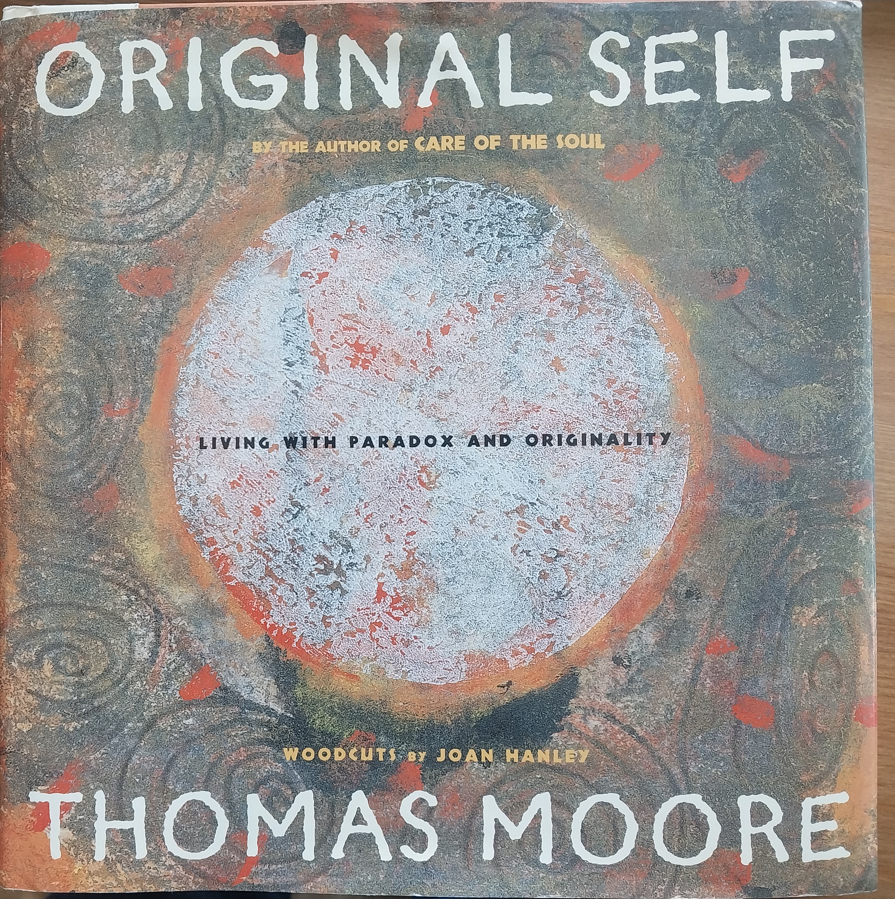
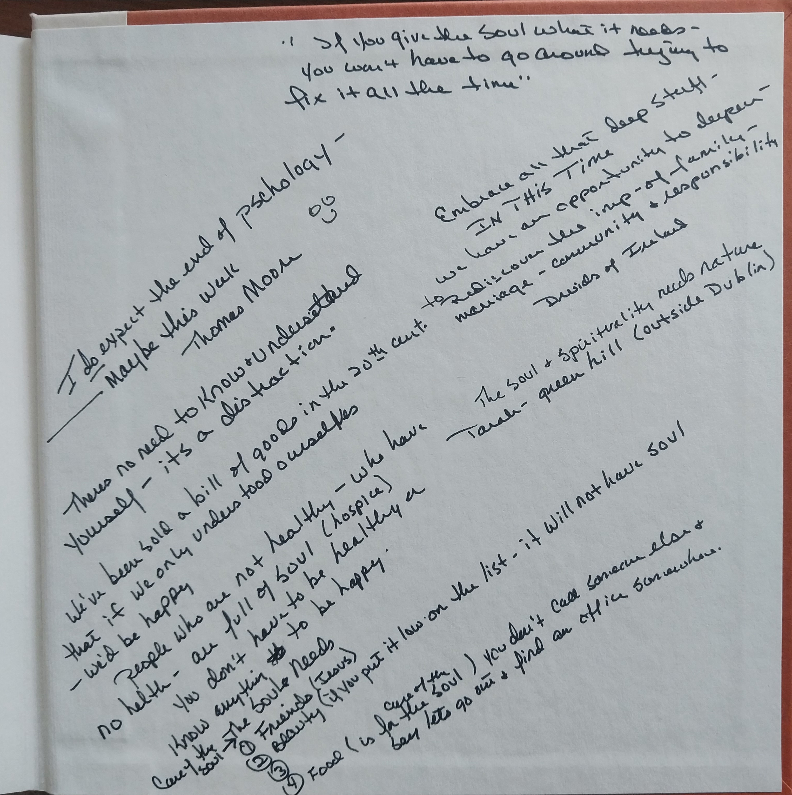

### The best used books arrive with anonymous and somehow deeply personal non-symbolic annotations, like intimate confidential missives from the soul of deep mystery

 

 

 

 

 

<!-- Default Video Embed
Watch [Video_Title](https://youtu.be/JnA8GUtXpXY) if the embed below does not behave nicely. 

<!-- Native HTML5 Embed - GitHub LFS storage: append ?raw=true  
<video width="560" height="320" controls>
  <source src="https://github.com/metavalent/metavalent.github.io/blob/gh-pages/assets/audio-video/FILENAME.mp4?raw=true" type="video/mp4">
  <source src=src="https://github.com/metavalent/metavalent.github.io/blob/gh-pages/assets/audio-video/FILENAME.webm?raw=true" type="video/webm">
Your browser does not support the video tag.
</video>
-->

<!-- YouTube Player
<iframe id="ytplayer" type="text/html" width="560" height="320"
  src="https://www.youtube.com/embed/imA1lpOdEhQ?autoplay=1"
  frameborder="0"></iframe>
-->

<!-- Maybe HTML5 Audio Embed - GitHub LFS storage: append ?raw=true  
<audio controls>
  <source src="https://github.com/metavalent/metavalent.github.io/blob/gh-pages/assets/audio-video/FILENAME.mp4?raw=true" type="audio/mpeg">
  <source src="https://github.com/metavalent/metavalent.github.io/blob/gh-pages/assets/audio-video/FILENAME.mp4?raw=true" type="audio/ogg">
Your browser does not support the audio element.
</audio>
-->

<!-- For custom thumbnail

-->

> Have you discovered or learned something interesting or valuable? Something that piqued your imagination, sparked creative insight, deepened research, enlivened discovery, or shed new light other academic, philosophical, or spiritual interest? Make it real with ETH 0x1eb2d6E3f26fBBF31B485bbe3e316D6dAd806632, Cashtag [$metavalent](https://cash.app/$metavalent), or [Patreon](https://patreon.com/metavalent). Mahalo means Respect and Gratitude without measure.🙏🏼
