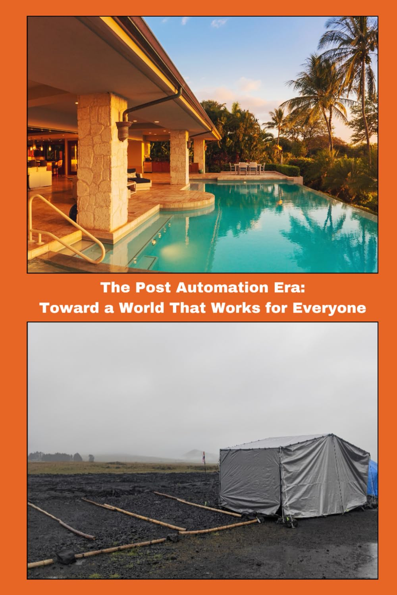

### Toward a World That Works for Everyone

Direct link to [The Post-Automation Era: Toward a World That Works for Everyone](https://www.amazon.com/dp/1732930031) if embed above doesn't behave nicely.

---
> Have you discovered or learned something interesting or valuable? Something that piqued your imagination, sparked creative insight, deepened research, enlivened discovery, or shed new light upon other academic, philosophical, or spiritual interest? Make it real with ETH 0x1eb2d6E3f26fBBF31B485bbe3e316D6dAd806632, Cashtag [$metavalent](https://cash.app/$metavalent), [Patreon](https://patreon.com/metavalent), or justbepono$paystring.crypto.com Mahalo means Respect and Gratitude without measure.🙏🏼
